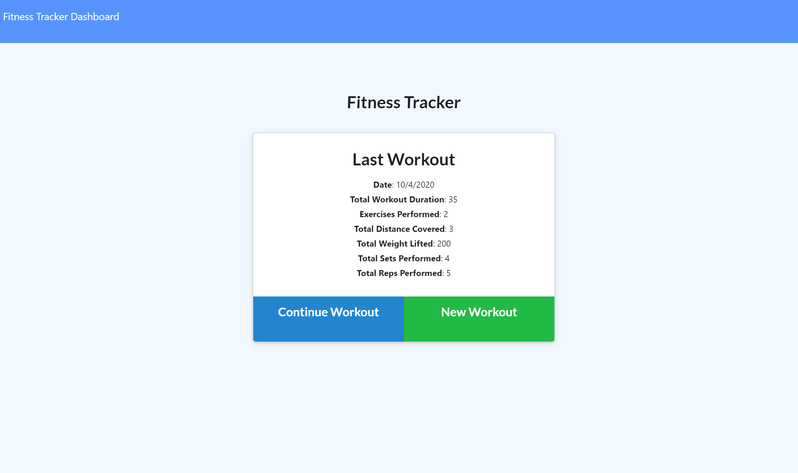
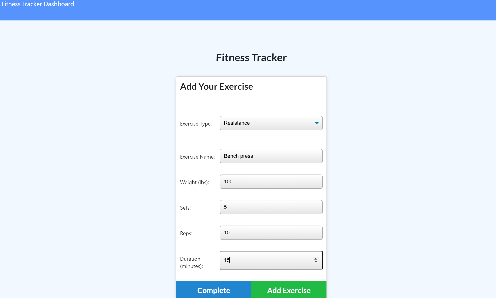
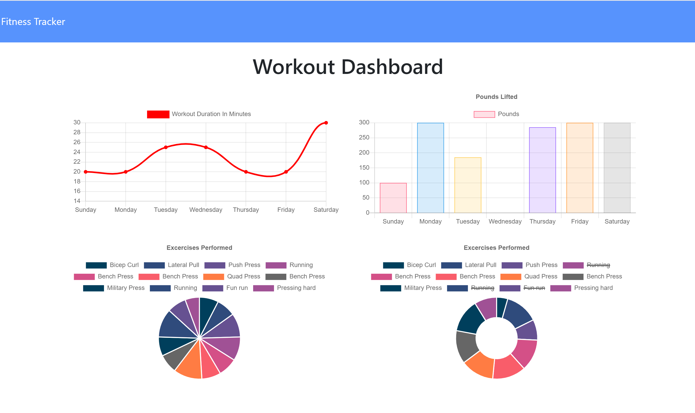

# Fitness Tracker 
## Description 
Fitness Tracker utilizes MongoDB to track a user's daily exercises. Weekly workout statistics are reflected on Dashboard charts.

### User Story
User wants to be able to view create and track daily workouts and to be able to log multiple exercises in a workout on a given day. I should also be able to track the name, type, weight, sets, reps, and duration of exercise. If the exercise is a cardio exercise, I should be able to track my distance traveled.

## Table of Contents
* [Installation](#installation)
* [Usage](#usage)
* [License](#license)
* [Questions](#questions)
* [Review](#review)

## Installation 
Simply clone the repo, and/or visit the deployed page link to begin.
## Usage 
Visit the deployed page link. https://afternoon-chamber-99661.herokuapp.com/

Welcome screen

Cardio workout input
 
Resistance workout input

Dashboard Charts examples

## Contributing 
 None 
## License 
 Licensed under MIT License. 
## Tests 
 None
## Questions 
 You can see more of my Projects on my [GitHub profile](https://github.com/sbolotnikov) 

 Contact [sbolotnikov](mailto:sbolotnikov@gmail.com) 
## Review 
  * Here is this repo link: https://github.com/sbolotnikov/fitnessTracker
 
  * Link: [Fitness Tracker](https://fitnesstracker-3r9u.onrender.com/)
